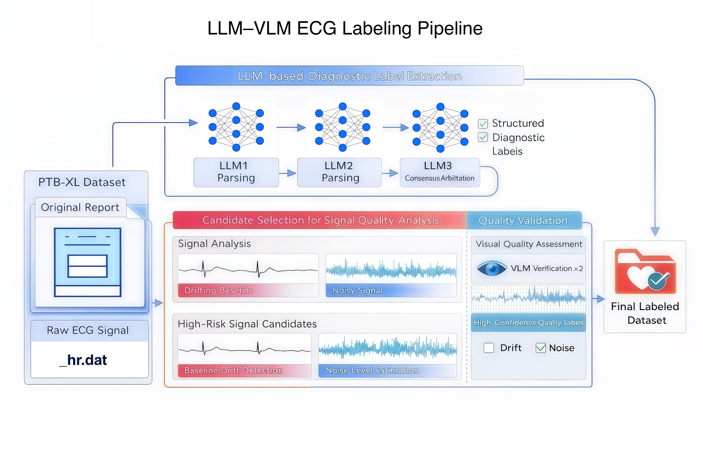

# ECG Diagnostic Label Construction and Signal Quality Annotation Pipeline Based on LLM and VLM (PTB-XL)

## Pipeline Overview


## Project Overview

This project constructs a complete ECG data preprocessing and annotation pipeline based on the PTB-XL dataset, integrating large language models (LLMs) and vision-language models (VLMs) to achieve:

1. Extracting structured diagnostic labels from original textual reports using LLMs as supervised signals  
2. Performing lead-level quality assessment of ECG signals (baseline drift and noise) using signal processing methods, and selecting candidate abnormal samples  
3. Applying VLM-based secondary verification on ECG images to extract high-confidence signal quality labels from candidate samples  
4. Fusing diagnostic labels with signal quality information to generate high-quality training data  

This pipeline emphasizes data reliability, consistency, and interpretability, and is suitable for subsequent ECG model training and research.

## Overall Pipeline

The workflow is divided into three parts:

1. Report-based label construction (Step 1–3)  
2. Signal quality assessment (Step 4–5)  
3. Data fusion (Step 6)  

Step1 → Step2 → Step3 → Step4 → Step5 → Step6

## Dataset

This project is based on the PTB-XL dataset.

- Official website: https://physionet.org/content/ptb-xl/1.0.3/  

- Source: PhysioNet
  
## Data Directory Structure

- data/
  - interim/ptbxl/
  - raw/ptbxl/
    - records500/
    - ptbxl_database.csv
    - SNOMED_labels.json
- outputs/ptbxl/
- src/
- requirements.txt
- run_ptbxl_pipeline.sh
  
**Notes:**

- Only the original PTB-XL dataset is required  
- Place the `records500/` directory under `data/raw/ptbxl/`  
- Ensure `ptbxl_database.csv` and `records500/` are in the same directory level

## Quick Start
```bash

cd /path/to/ecg_preprocessing_pipeline

pip install -r requirements.txt

# set API keys

export DEEPSEEK_API_KEY=xxx

export DASHSCOPE_API_KEY=xxx

# run pipeline

bash run_ptbxl_pipeline.sh
```

## Parameters

- ROOT_DIR: project root directory  
- DEEPSEEK_API_KEY: LLM calls  
- DASHSCOPE_API_KEY: VLM calls  

## Optional Parameters

- STEP2_MAX_WORKERS  
- STEP3_3_MAX_WORKERS  
- STEP4_MAX_WORKERS  
- STEP5_MAX_WORKERS  

- STEP2_MODEL_NAME  
- STEP5_MODEL_NAME  
- STEP5_BASE_URL

## Environment Setup

This project is implemented in Python, and Python 3.10 or above is recommended.

pip install -r requirements.txt

If missing dependencies occur during execution (e.g., ModuleNotFoundError), install the required packages manually as prompted.

## Step 1: Identification of Human-Involved Samples and Initialization

Human-involved samples are selected from PTB-XL metadata, and the LLM input structure is initialized.

Rule:

A sample is defined as “machine-only” if all of the following conditions are satisfied:

- validated_by is NaN  
- initial_autogenerated_report == True  
- validated_by_human != True  

All other samples are considered human-involved samples.

Input:
data/raw/ptbxl/ptbxl_database.csv

Output:
data/interim/ptbxl/ptbxl_database_with_machine_flag.csv  
data/interim/ptbxl/ptbxl_human_report_empty_schema.jsonl  

## Step 2: LLM-Based Report Label Extraction

Structured parsing is performed on reports from human-involved samples.

Workflow:

- LLM1: independent parsing  
- LLM2: independent parsing  
- LLM3: arbitration based on the first two  

Input:
data/interim/ptbxl/ptbxl_human_report_empty_schema.jsonl  
data/raw/ptbxl/SNOMED_labels.json  

Output:
outputs/ptbxl/step2_ptbxl_human_report_filled.jsonl  
outputs/ptbxl/step2_ptbxl_human_report_error_log.jsonl  

Characteristics:

- Supports checkpoint resume  
- Unmapped labels are retained for subsequent processing  

## Step 3: Label Consistency Filtering and Refinement

### Step 3.1: Consistency Filtering

Retention criteria:

- If LLM1 and LLM2 outputs are identical or highly consistent → directly retained  
- If LLM1 and LLM2 conflict → retained only when:  
  - LLM3 matches either LLM1 or LLM2  
  - or LLM3 equals the union of LLM1 and LLM2  

Output:
step3_1_ptbxl_human_report_kept.jsonl  
step3_1_ptbxl_human_report_dropped.jsonl  

### Step 3.2: Extraction of Consensus Unmapped Labels

Only unmapped items that are consistent across models are retained:

- LLM1 and LLM2 unmapped results are identical  
- or LLM3 matches LLM1 or LLM2  
- or LLM3 equals the union  

Output:
step3_2_ptbxl_consensus_unmapped.jsonl  

### Step 3.3: Unmapped Label Mapping

- LLM1 and LLM2 perform independent mapping  
- LLM3 performs arbitration  

Output:
step3_3_ptbxl_consensus_unmapped_terms_filled.jsonl  

### Step 3.4: Label Fusion and Rule-Based Cleaning

- Remove “Normal ECG” if abnormal findings exist  
- Add “Normal ECG” if only “Sinus Rhythm” exists  
- Remove “Sinus Rhythm” if conflicting  

Output:
step3_4_ptxbl_report_llm_label.jsonl  

## Step 4: Signal Quality Computation

Metrics:

- baseline drift (<0.5 Hz)  
- noise (high-frequency disturbance)  

Output:
step4_signal_quality_top5.jsonl  
step4_signal_quality_summary.json  

Only top 5% abnormal leads are retained.

## Step 5: VLM-Based Signal Quality Verification

Workflow:

1. Render ECG images  
2. Run VLM twice  
3. Check consistency  

Criteria:

- drift: baseline shift  
- noise: sustained high-frequency disturbance  

Input:
step4_signal_quality_top5.jsonl  
ptbxl_database.csv  
records500/  

Output:
step5_vlm_quality_results.jsonl  
step5_vlm_quality_error.jsonl  

## Step 6: Fusion

Only samples with consistent VLM results (both = 1) are retained.

Output:
ptxbl_report_llm_label_with_vlm_quality.jsonl  


## Design Considerations

1. Multi-model consistency improves reliability  
2. Signal processing + VLM improves robustness  
3. Human reports reduce noise  
4. Decoupled label design  

## Output Features

- Structured diagnostic labels  
- Lead-level quality labels  
- Supports interpretability  
- Suitable for multi-task learning  


# 中文版
# 基于 LLM 与 VLM 的 ECG 诊断标签构建与信号质量标注流程（PTB-XL）

## 项目概述

本项目构建了一套完整的 ECG 数据预处理与标注流程，基于 PTB-XL 数据集，结合大语言模型（LLM）与视觉语言模型（VLM），实现:

* 通过 LLM 从原始文本报告中提取结构化诊断标签，作为可监督信号
* 基于信号处理方法对 ECG 进行导联级质量评估（基线漂移与噪声），并筛选候选异常样本
* 结合 VLM 对 ECG 图像进行二次验证，从候选样本中提取高置信的信号质量标签
* 融合诊断标签与信号质量信息，生成高质量训练数据

该流程强调数据可靠性、一致性以及可解释性，适用于后续 ECG 模型训练与研究。

## 整体流程

流程分为三个部分:

* 报告标签构建（Step 1-3）
* 信号质量评估（Step 4-5）
* 数据融合（Step 6）

Step1 -> Step2 -> Step3 -> Step4 -> Step5 -> Step6

## 数据集

本项目基于 PTB-XL 数据集。

- 官方网站: https://physionet.org/content/ptb-xl/1.0.3/  

- 数据来源: PhysioNet
  
## 数据目录结构

- data/
  - interim/ptbxl/
  - raw/ptbxl/
    - records500/
    - ptbxl_database.csv
    - SNOMED_labels.json
- outputs/ptbxl/
- src/
- requirements.txt
- run_ptbxl_pipeline.sh

**说明:**

- 仅需下载 PTB-XL 原始数据  
- 将 `records500/` 目录放入 `data/raw/ptbxl/` 下  
- 确保 `ptbxl_database.csv` 与 `records500/` 位于同一目录层级  

## 轻启动
```bash

cd /path/to/ecg_preprocessing_pipeline

pip install -r requirements.txt

# set API keys

export DEEPSEEK_API_KEY=xxx

export DASHSCOPE_API_KEY=xxx

# run pipeline

bash run_ptbxl_pipeline.sh
```


参数说明

* ROOT_DIR: 项目根目录路径（即本项目所在目录）
* DEEPSEEK_API_KEY: 用于 Step 2 / Step 3 中 LLM 调用（文本报告解析与标签映射）
* DASHSCOPE_API_KEY: 用于 Step 5 中 VLM 调用（ECG 图像信号质量验证）

⚡ 运行参数（可选）

* STEP2_MAX_WORKERS: Step 2 并发线程数（LLM 标签提取）
* STEP3_3_MAX_WORKERS: Step 3 并发线程数
* STEP4_MAX_WORKERS: Step 4 并发线程数
* STEP5_MAX_WORKERS: Step 5 并发线程数（VLM 推理）
* STEP2_MODEL_NAME / STEP3_3_MODEL_NAME: LLM 模型名称
* STEP5_MODEL_NAME: VLM 模型名称
* STEP5_BASE_URL: VLM API 接口地址


## 环境配置

本项目基于 Python 实现，建议使用 Python 3.10 及以上版本。

pip install -r requirements.txt

如果在运行过程中出现缺失依赖（如 ModuleNotFoundError），可根据提示手动安装对应包。


## Step 1: 筛选人工参与样本并初始化结构

从 PTB-XL metadata 中筛选具有人工参与的样本，并初始化 LLM 输入结构。

规则

一个样本被定义为 “纯机器生成” 需同时满足:

* validated_by 为 NaN
* initial_autogenerated_report == True
* validated_by_human != True

其余样本视为 “人工参与样本”。

输入

* data/raw/ptbxl/ptbxl_database.csv

输出

* data/interim/ptbxl/ptbxl_database_with_machine_flag.csv
* data/interim/ptbxl/ptbxl_human_report_empty_schema.jsonl

## Step 2: 基于 LLM 的报告标签提取

对人工参与样本的报告文本进行结构化解析。

流程

* LLM1: 独立解析
* LLM2: 独立解析
* LLM3: 基于前两者进行仲裁

输入

* data/interim/ptbxl/ptbxl_human_report_empty_schema.jsonl
* data/raw/ptbxl/SNOMED_labels.json

输出

* outputs/ptbxl/step2_ptbxl_human_report_filled.jsonl
* outputs/ptbxl/step2_ptbxl_human_report_error_log.jsonl

特点

* 支持断点续跑
* 未映射标签（unmapped）保留用于后续处理

## Step 3: 标签一致性筛选与修复

### Step 3.1: 一致性筛选

保留条件:

* 当 LLM1 与 LLM2 的解析结果一致或高度一致时, 直接保留
* 当 LLM1 与 LLM2 存在冲突时, 仅在以下情况下保留:
    * LLM3 的仲裁结果与 LLM1 或 LLM2 其中之一一致
    * 或 LLM3 的结果等于 LLM1 与 LLM2 的并集

输出:

* step3_1_ptbxl_human_report_kept.jsonl
* step3_1_ptbxl_human_report_dropped.jsonl

### Step 3.2: 提取一致的 unmapped 标签

在通过 Step 3.1 一致性筛选的样本中, 进一步提取其未成功映射（unmapped）的标签。

仅保留在多个模型结果中一致的 unmapped 项, 包括:

* LLM1 与 LLM2 的 unmapped 完全一致
* 或 LLM3 的结果与 LLM1 或 LLM2 一致
* 或 LLM3 的结果等于 LLM1 与 LLM2 的并集

输出:

* step3_2_ptbxl_consensus_unmapped.jsonl

### Step 3.3: unmapped 标签映射

对 unmapped 标签进行统一映射, 采用三阶段 LLM 机制:

* LLM1 与 LLM2 分别独立进行映射
* LLM3 对两者结果进行仲裁, 生成最终映射结果

输出:

* step3_3_ptbxl_consensus_unmapped_terms_filled.jsonl

### Step 3.4: 标签融合与规则清洗

融合 mapped 与 unmapped 映射结果, 并应用规则:

* 正常 ECG 与异常共存时删除 “正常心电图”
* 仅存在 “窦性心律” 时补充 “正常心电图”
* 与严重节律冲突时删除 “窦性心律”

输出:

* step3_4_ptxbl_report_llm_label.jsonl

## Step 4: 信号质量计算（全量数据）

对所有 ECG（不区分是否人工参与）计算导联级质量指标。

指标

* baseline drift: 低频基线波动（<0.5 Hz）
* noise: 高频噪声比例与局部扰动特征

方法要点

* 滤波分解（低频 / ECG 带 / 高频）
* 排除高幅值与高斜率区域（减少 QRS 干扰）
* 局部窗口统计（0.5 秒窗口）

输出

* step4_signal_quality_top5.jsonl
* step4_signal_quality_summary.json

仅保留分布中 top 5% 的异常导联。

## Step 5: 基于 VLM 的信号质量验证

对 Step 4 筛选出的候选样本进行视觉验证。

流程

* 渲染单导联 ECG 图像
* 调用 VLM 验证两次
* 判断结果是否一致

判定标准

* drift: 基线是否整体偏移
* noise: 是否存在持续高频扰动

输入

* step4_signal_quality_top5.jsonl
* ptbxl_database.csv
* records500/

输出

* step5_vlm_quality_results.jsonl
* step5_vlm_quality_error.jsonl

## Step 6: 诊断标签与质量标签融合

将 Step 3.4 的诊断标签与 Step 5 的信号质量标签进行融合。

融合规则

* 仅保留 VLM 两次结果一致且为 1 的样本

输入

* step3_4_ptxbl_report_llm_label.jsonl
* step5_vlm_quality_results.jsonl

输出

* ptxbl_report_llm_label_with_vlm_quality.jsonl

## 运行方式

bash run_pipeline.sh

填写:

* ROOT_DIR=”/path/to/ecg_preprocessing_pipeline”
* DEEPSEEK_API_KEY=“xxx”
* DASHSCOPE_API_KEY=“xxx”


## 设计要点

* 使用多模型一致性机制, 提高标签可靠性
* 将信号处理与视觉模型结合, 提升质量评估鲁棒性
* 优先使用人工参与报告, 降低数据噪声
* 诊断标签与信号质量解耦处理, 避免相互干扰

## 最终输出数据特点

* 结构化诊断标签
* 导联级信号质量标签
* 支持模型可解释性分析
* 适用于多任务学习与鲁棒性训练
